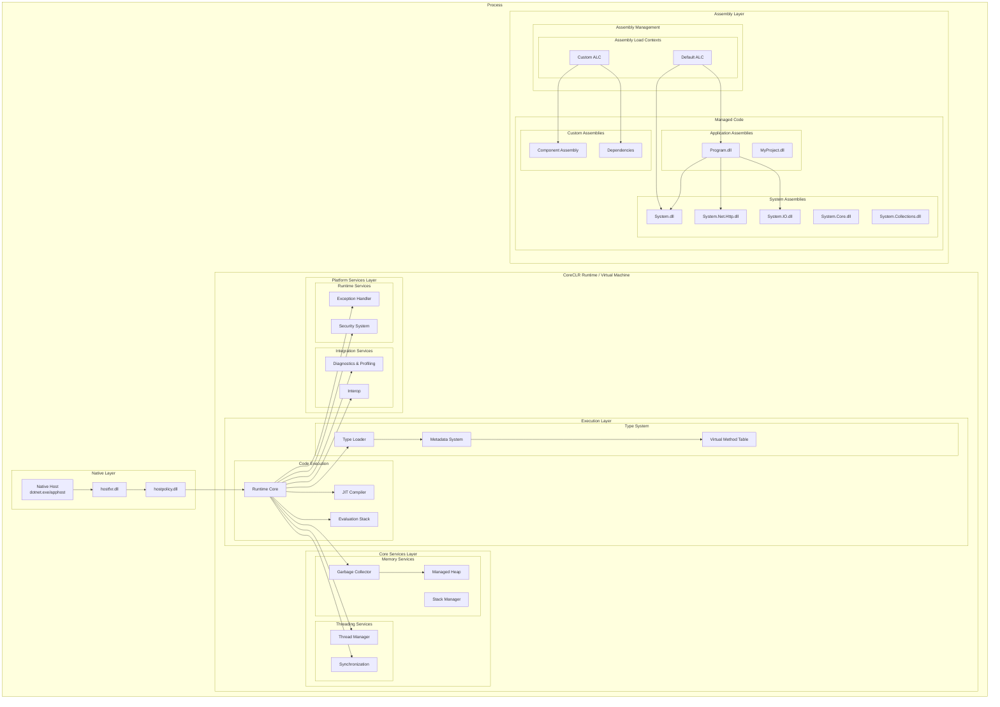

```mermaid
graph TB
    subgraph "Process"
        subgraph "Native Layer"
            NH[Native Host<br/>dotnet.exe/apphost]
            HF[hostfxr.dll]
            HP[hostpolicy.dll]
            
            NH --> HF
            HF --> HP
        end

        subgraph "CoreCLR Runtime / Virtual Machine"
            subgraph "Core Services Layer"
                subgraph "Memory Services"
                    HEAP[Managed Heap]
                    GC[Garbage Collector]
                    STACK[Stack Manager]
                    
                    GC --> HEAP
                end
                
                subgraph "Threading Services"
                    THREAD[Thread Manager]
                    SYNC[Synchronization]
                end
            end

            subgraph "Execution Layer"
                subgraph "Code Execution"
                    RT[Runtime Core]
                    JIT[JIT Compiler]
                    EVAL[Evaluation Stack]
                end
                
                subgraph "Type System"
                    TYL[Type Loader]
                    MD[Metadata System]
                    VT[Virtual Method Table]
                    
                    TYL --> MD
                    MD --> VT
                end
            end

            subgraph "Platform Services Layer"
                subgraph "Runtime Services"
                    EH[Exception Handler]
                    SEC[Security System]
                end
                
                subgraph "Integration Services"
                    DIAG[Diagnostics & Profiling]
                    INTER[Interop]
                end
            end
        end

        subgraph "Assembly Layer"
            subgraph "Assembly Management"
                subgraph "Assembly Load Contexts"
                    D_ALC[Default ALC]
                    C_ALC[Custom ALC]
                end
            end

            subgraph "Managed Code"
                subgraph "System Assemblies"
                    SYS[System.dll]
                    CORE[System.Core.dll]
                    NET[System.Net.Http.dll]
                    COL[System.Collections.dll]
                    IO[System.IO.dll]
                end
                
                subgraph "Application Assemblies"
                    APP[Program.dll]
                    PROJ[MyProject.dll]
                end
                
                subgraph "Custom Assemblies"
                    COMP[Component Assembly]
                    DEP[Dependencies]
                end
            end
        end

        %% Layer connections
        HP --> RT
        
        %% Core Services connections
        RT --> GC
        RT --> THREAD
        RT --> SYNC
        
        %% Execution Layer connections
        RT --> JIT
        RT --> EVAL
        RT --> TYL
        
        %% Platform Services connections
        RT --> EH
        RT --> SEC
        RT --> DIAG
        RT --> INTER
        
        %% Assembly Layer connections
        D_ALC --> APP
        D_ALC --> SYS
        C_ALC --> COMP
        C_ALC --> DEP
        
        %% Cross-layer dependencies
        APP --> SYS
        APP --> NET
        APP --> IO
    end
  
```