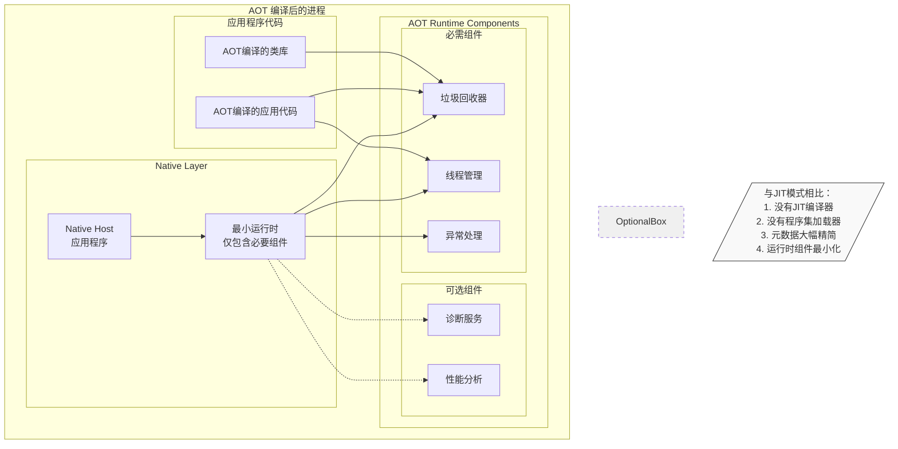

# dotnet 运行时架构

## AOT 编译程序的运行时实例

## AOT 运行时特点说明：

1. **单一运行时实例**
   - AOT 编译的程序只需要一个最小化的运行时实例
   - 运行时组件被静态链接到应用程序中

2. **必需组件**
   - 垃圾回收器（GC）：内存管理仍然必需
   - 线程管理：处理并发和同步
   - 异常处理：处理运行时异常

3. **精简特性**
   - 没有 JIT 编译器
   - 没有动态程序集加载
   - 元数据信息最小化
   - 类型系统简化

4. **性能优势**
   - 启动更快（无需 JIT）
   - 内存占用更少
   - 可预测的性能表现

5. **限制**
   - 动态特性受限
   - 反射功能受限
   - 运行时不可更新
  