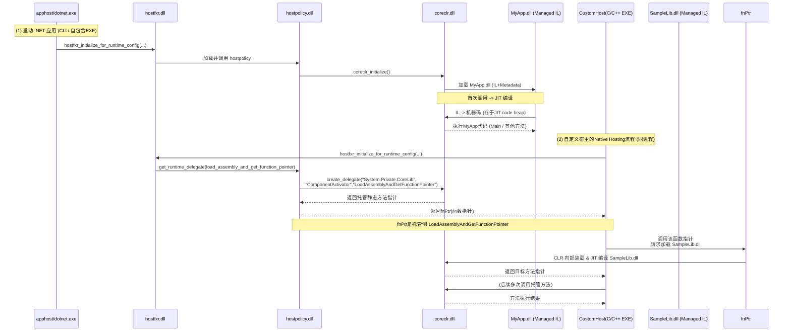

# .NET Native Hosting 和托管程序集的交互

本文档从应用程序（.NET）的编译、运行切入，系统地介绍了 .net native hosting 技术如何通过一系列组件（如 `apphost`, `hostfxr`, `hostpolicy`, `coreclr`）的协作来达到自定义执行托管程序集，同时也概括了 JIT 与 AOT场景下的异同及关键原理。文档后半部分也对托管类型在 CLR 内部的表示方式（MethodTable / TypeHandle）做了概括性说明。

---

## 概述：从启动到执行

一个 .NET 应用程序（无论是命令行 `dotnet MyApp.dll`，还是自包含 EXE，或自定义 Native Hosting）在启动时，会先由**宿主**进程/可执行载入，再通过 `.NET Hosting` 相关的原生库（hostfxr / hostpolicy）协调加载 `.NET Runtime`（coreclr），最后再把我们的托管程序集（.NET Assembly）载入并执行。

在典型的 .NET 6+ 单文件或自包含部署里，一些组件会被打包到同一个可执行文件中，流程本质类似，但物理文件整合在一起。

---

## 关键组件与角色

### apphost
- **apphost** 是一种生成好的原生启动器（exe），由 .NET SDK 在发布阶段生成。  
- 当你发布自包含的 .NET 应用程序（`dotnet publish -r <rid> -p:PublishSingleFile=true`）时，SDK 会把 `hostfxr`、`hostpolicy` 等打包进最终的单文件 exe（这也是“apphost”）。用户双击该 exe，就相当于先启动了原生主程序，再进入到后续的 .NET runtime 初始化流程。

### hostfxr
- **hostfxr**（如 `hostfxr.dll` / `.so`）是最外层的 Hosting API 库，它负责：  
  1. **解析** 应用的 `.runtimeconfig.json`、.NET 版本、依赖信息；  
  2. **定位并加载** `hostpolicy`；  
  3. 向外暴露一组“Native Hosting API”（如 `hostfxr_initialize_for_runtime_config`、`hostfxr_get_runtime_delegate`），方便自定义宿主调用。  

- 在“命令行执行”场景里，是 `dotnet.exe` 先加载 `hostfxr` 并调用其初始化逻辑。

### hostpolicy
- **hostpolicy**（如 `hostpolicy.dll` / `.so`）是宿主策略库，它承接 `hostfxr` 的调用，进一步负责：
  - 读取并处理 **依赖解析**（依赖 `.deps.json` 里的信息）  
  - **启动 coreclr**：加载并初始化 .NET runtime  
  - 暴露出若干内部枚举和接口（如 `coreclr_delegate_type`）给 `hostfxr` 及上层宿主用，用于获取特定的 runtime 委托（delegate）  
- 在源代码层面可见 [hostpolicy.cpp](https://github.com/dotnet/runtime/blob/main/src/native/corehost/hostpolicy/hostpolicy.cpp) 展示了它如何处理不同类型的 delegate 请求，如 `load_assembly_and_get_function_pointer`。

### coreclr
- **coreclr**（如 `coreclr.dll` / `.so`）是 .NET 的真正运行时引擎，包含 **JIT**、**GC**、**类型系统**、**线程管理** 等。
- 对宿主层暴露一些 API（例如 `ICLRRuntimeHost2::CreateDelegate`）来动态获取托管方法的原生调用入口点，或执行托管程序集的 `Main` 方法。
- 在 .NET 5+ 统一 branding 下，也称 `.NET runtime`。底层仍是 CoreCLR。

### managed assembly
- **托管程序集**（.dll / .exe）指我们用 C# 或其他 .NET 语言编译出的 IL+元数据文件。  
- 最终在 .NET runtime（coreclr）下 JIT 或 AOT 执行。

---

## 应用程序生命周期：启动流程与模块协作

下面以 **JIT 场景** 的 .NET 应用为例（最常见）：

1. **用户启动应用**（双击 EXE 或命令行 `dotnet MyApp.dll`）  
2. **apphost / dotnet.exe 加载 `hostfxr`**  
   - `hostfxr` 读取 `.runtimeconfig.json`，确定 .NET 版本和路径
   - 加载 `hostpolicy` 并调用其初始化接口
3. **hostpolicy 初始化并解析依赖**  
   - 读取 `.deps.json` 信息，确定要加载的托管程序集列表和 probing 路径
   - `hostpolicy` 加载并初始化 `coreclr`
4. **coreclr 启动，加载入口程序集**  
   - 根据托管程序集的 `Main()`（或宿主指定的方法指针）开始执行
   - 当方法第一次被调用时，JIT 编译 IL 到机器码
5. **运行时执行**  
   - .NET 应用逻辑开始运行，CLR 管理 GC、异常处理等，直至进程退出。

**主线思路**就是：宿主(原生进程) -> `hostfxr` -> `hostpolicy` -> `coreclr` -> 加载并执行 managed assembly。

```mermaid
flowchart TB
    A([apphost / dotnet.exe]) 
    B([hostfxr.dll])
    C([hostpolicy.dll])
    D([coreclr.dll])
    E([Managed_Assembly])

    style A fill:#fff,stroke:#777,stroke-width:1px,color:#333
    style B fill:#fff,stroke:#777,stroke-width:1px,color:#333
    style C fill:#fff,stroke:#777,stroke-width:1px,color:#333
    style D fill:#fff,stroke:#777,stroke-width:1px,color:#333
    style E fill:#fff,stroke:#777,stroke-width:1px,color:#333

    A:::host
    B:::host
    C:::host
    D:::runtime
    E:::managed

    classDef host fill:#e6ffee,stroke:#028482,color:#000
    classDef runtime fill:#fff2e6,stroke:#c66b12,color:#000
    classDef managed fill:#e7e9ff,stroke:#4e58b2,color:#000

    subgraph "启动流程"
      A -->|Initialize config<br/>parse .runtimeconfig.json| B
      B -->|Load & call hostpolicy| C
      C -->|Initialize .NET Runtime<br/>parse .deps.json| D
      D -->|Load & JIT<br/>Managed IL| E
    end

```






---

## Native Hosting 与 `create_delegate`

### `load_assembly_and_get_function_pointer` 简述

在“自定义宿主”场景里（也称 **Native Hosting**），我们可能直接用 C/C++ 自己写一个 EXE，然后调用 `hostfxr` API 来手动控制 runtime。流程通常是：

1. **调用 `hostfxr_initialize_for_runtime_config`**  
   - 传递 `.runtimeconfig.json` 或者手动提供 runtime 目录信息。  
2. **获取指定类型的委托**（枚举类型 `coreclr_delegate_type`）  
   - 例如 `load_assembly_and_get_function_pointer`：  
     ```cpp
     // hostpolicy.cpp 的对应逻辑
     case coreclr_delegate_type::load_assembly_and_get_function_pointer:
         return coreclr->create_delegate(
             "System.Private.CoreLib",
             "Internal.Runtime.InteropServices.ComponentActivator",
             "LoadAssemblyAndGetFunctionPointer",
             delegate);
     ```
   - 这里 `create_delegate` 会拿到托管方法 `ComponentActivator.LoadAssemblyAndGetFunctionPointer` 的原生函数指针。
3. **调用该函数指针**  
   - 这个托管方法内负责加载指定的 .NET assembly 并获取其中某个方法指针，再返回给原生层。  
   - 整个过程保持在**同一个进程**中，CoreCLR 与原生宿主通过函数指针互操作。

**核心**：`hostpolicy` 并没有直接调用 CLR 内部私有API去加载程序集，而是通过托管公共入口点（`System.Private.CoreLib` 内的静态方法）来实现。这样保持了模块分层清晰和可维护性。

---

## 托管代码执行机制：JIT & AOT

### JIT (Just-In-Time)
- **编译时**：托管程序集以 IL+元数据形式存在。  
- **运行时**：当方法第一次调用时，CoreCLR 内部的 JIT 编译器把 IL 转成机器码，存入内存中的“JIT code heap”。  
- **调用约定统一**：CoreCLR 的 C++ 原生代码与 JIT 生成的机器码在同一进程内协同，通过函数指针和共享的 runtime 数据结构（MethodDesc, MethodTable 等）进行交互。

### AOT (Ahead-Of-Time)
- 在编译/发布阶段，就将 IL 编译成原生机器码，可能与 `.NET runtime` 一起打包进一个可执行或库文件中。  
- 运行时不再需要 JIT，但仍然需要 CLR 的 GC、类型系统、异常处理等服务。  
- **NativeAOT** 或 **ReadyToRun**（Crossgen2）等方案，都属于 AOT 的具体实现方式。  
- **相同点**：最终还是在同一个 runtime 环境中执行（只是不再即时编译 IL）。

---

## CLR 中的托管类型：MethodTable / TypeHandle

### C# 类与 CLR 内部结构的对应

当我们在 C# 中定义 `class MyClass { ... }`，编译器会生成 IL 和元数据。CoreCLR 加载该程序集后，会在内部为此类分配一个 **MethodTable**（或称 EEClass）结构来描述：
- 方法列表 / 字段偏移 / 虚函数表指针等
- 与 GC、异常处理协作所需的元信息

**对象实例**在运行时分配于托管堆时，会在其头部存储指向该 `MethodTable` 的指针。  
调用 `myObj.SomeMethod()` 时，JIT 生成的机器码会根据 `MethodTable` 查找对应的函数入口点。

### 并非“C#类 -> C++类”

**CLR** 虽然用 C++ 实现，但 C# 类不会被编译成一个固定的“C++ struct/class”；而是**元数据驱动 + 运行时动态生成**方式。  
- 最终在 CLR 内部，是一套专门的原生数据结构来管理 .NET 类型系统。  
- JIT 或 AOT 编译器与这些数据结构协同工作，在 GC、异常处理、反射等方面保持一致的 ABI 和元数据信息。

---

## 参考链接 & 示例位置

1. **dotnet/runtime 源码仓库**  
   - [dotnet/runtime/blob/main/src/native/corehost/hostpolicy/hostpolicy.cpp](https://github.com/dotnet/runtime/blob/main/src/native/corehost/hostpolicy/hostpolicy.cpp)  
     - 包含 `coreclr_delegate_type` 相关逻辑及 `create_delegate` 示例。  

2. **Native Hosting 示例**  
   - https://github.com/dotnet/samples/tree/main/core/hosting
     - 演示如何在原生代码中使用 `hostfxr` / `hostpolicy` 来初始化 .NET runtime 并调用托管方法。

3. **ComponentActivator.LoadAssemblyAndGetFunctionPointer 源码**  
   - [System.Private.CoreLib/src/Internal/Runtime/InteropServices/ComponentActivator.cs](https://github.com/dotnet/runtime/blob/main/src/libraries/System.Private.CoreLib/src/Internal/Runtime/InteropServices/ComponentActivator.cs)  
     - 托管侧静态方法，用于在 Native Hosting 场景中加载指定程序集并获取方法指针。

4. **CoreCLR / MethodTable, EEClass, JIT**  
   - [dotnet/runtime/blob/main/src/coreclr/](https://github.com/dotnet/runtime/tree/main/src/coreclr) 目录  
   - 内含 CLR 的 GC、JIT、类型系统等实现细节。

5. **更多资料**  
   - [.NET Docs: Writing a custom .NET host (Native Hosting)](https://docs.microsoft.com/dotnet/core/tutorials/netcore-hosting)

---

### 完

以上内容汇总了 .NET 应用在运行时的核心组件、启动过程、JIT/AOT 异同，以及我们重点关注的在自定义宿主场景中，`hostfxr`, `hostpolicy`, `coreclr`, `managed assembly` 如何协同工作，以及托管类型在 CLR 内部的数据结构对应关系。希望能帮助你从应用程序的生命周期角度，对 .NET runtime 有一个系统性的理解。
